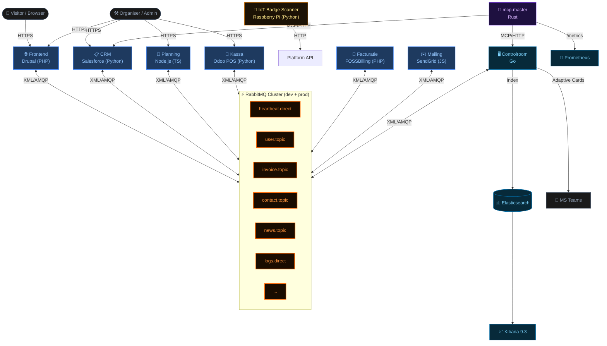
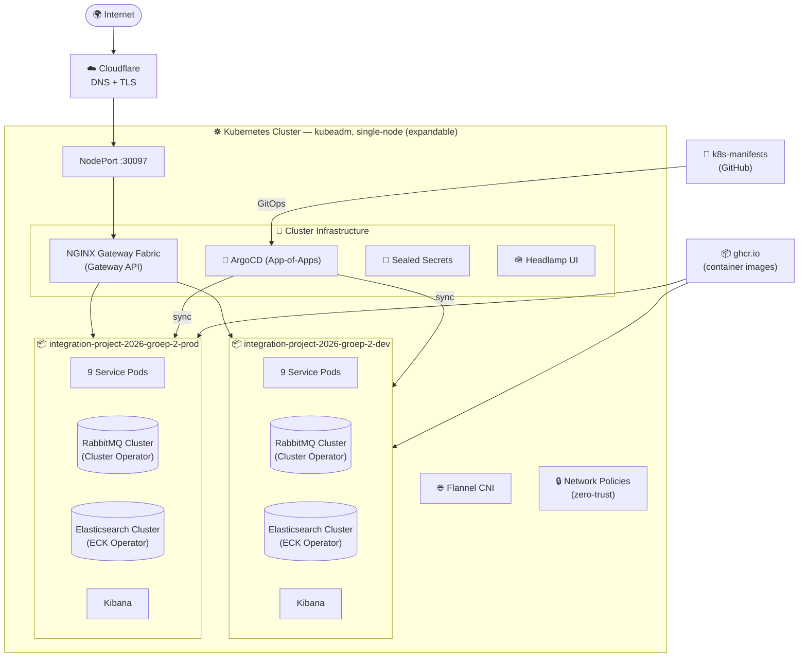
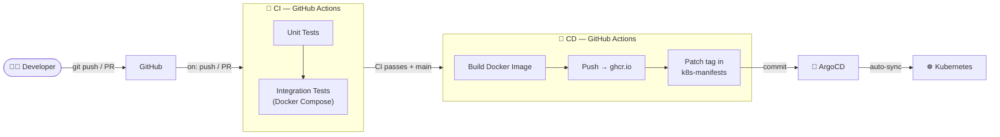
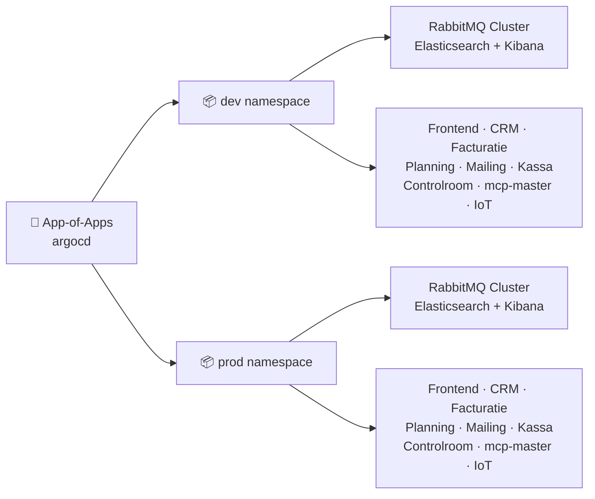
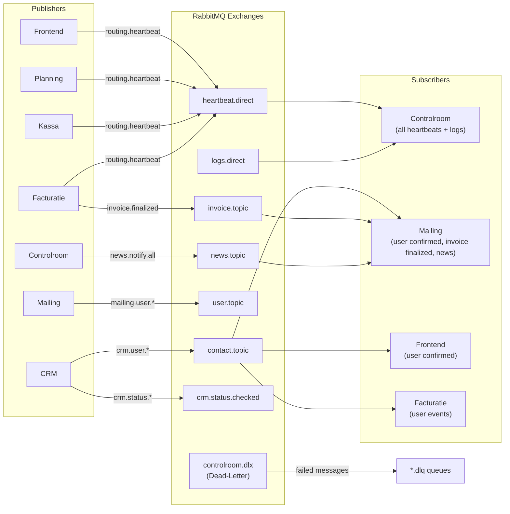
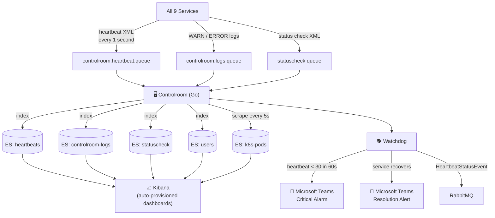
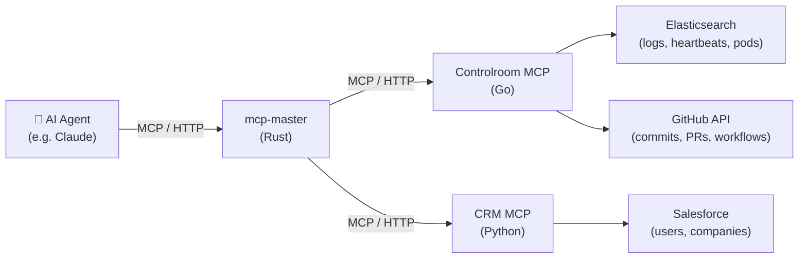

<div align="center">

<a href="https://github.com/Integration-Project-2026-Groep-2"></a>

[](https://kubernetes.io/)
[](https://github.com/flannel-io/flannel)
[](https://argoproj.github.io/cd/)
[](https://www.rabbitmq.com/)
[](https://www.elastic.co/)
[](https://www.elastic.co/kibana)
[](https://www.cloudflare.com/)
[](https://github.com/features/actions)
[](https://ghcr.io)

**A fully integrated event management platform — 9 microservices, one Kubernetes cluster.**  
Services communicate asynchronously via **RabbitMQ** (XML/XSD), are deployed through **ArgoCD** GitOps,  
monitored in real-time by **Elasticsearch + Kibana**, and AI-diagnosed via the **Model Context Protocol**.

🌐 **[www.integration-project-2026-groep-2.my.be](https://www.integration-project-2026-groep-2.my.be)**

</div>

---

## 📑 Table of Contents

- [Project Overview](#-project-overview)
- [System Architecture](#-system-architecture)
- [Services](#-services)
- [Infrastructure & Kubernetes](#️-infrastructure--kubernetes)
- [Messaging — RabbitMQ](#-messaging--rabbitmq)
- [Observability — Controlroom](#-observability--controlroom)
- [AI Integration — MCP](#-ai-integration--mcp)
- [IoT — Badge Scanner](#-iot--badge-scanner)
- [CI/CD Pipeline](#️-cicd-pipeline)
- [Repository Structure](#-repository-structure)
- [Getting Started (Local)](#-getting-started-local)
- [Getting Started (Kubernetes)](#️-getting-started-kubernetes)
- [Branch Strategy](#-branch-strategy)
- [Credits](#-credits)

---

## 🎯 Project Overview

**Integration Project 2026 — Groep 2** is a polyglot microservice platform built for EhB (Erasmushogeschool Brussel). It manages the full lifecycle of an event: visitor registration, session scheduling, on-site payments & consumption tracking, invoicing, transactional email, and real-time platform monitoring — all connected through a shared message broker.

The platform runs on a **single-node Kubernetes cluster** (expandable), deployed via **ArgoCD GitOps** across separate `dev` and `prod` namespaces, with traffic entering through **Cloudflare** onto **NGINX Gateway Fabric**.

| Capability | Service | Technology |
|---|---|---|
| Public website & visitor registration | Frontend | Drupal (PHP) |
| Customer relationship management | CRM | Salesforce (Python) |
| Session & speaker scheduling | Planning | Node.js (TypeScript) |
| On-site payments & consumptions | Kassa | Odoo POS (Python) |
| QR-Code badge identification | IoT Badge Scanner | Raspberry Pi (Python) |
| Invoicing & billing | Facturatie | FOSSBilling (PHP) |
| Transactional email | Mailing | SendGrid (JavaScript) |
| Monitoring, logging & alerting | Controlroom | Go + Elasticsearch |
| AI-assisted diagnostics | mcp-master | Rust (MCP) |
| Message transport | — | RabbitMQ (XML/AMQP) |
| Deployment | — | Kubernetes + ArgoCD |

---

## 🏗 System Architecture

### Service Interaction Map



### Kubernetes Cluster Architecture



### CI/CD Flow



---

## 🧩 Services

### <a href="https://github.com/Integration-Project-2026-Groep-2/Frontend"></a>
[](https://github.com/Integration-Project-2026-Groep-2/Frontend)
[](https://github.com/Integration-Project-2026-Groep-2/Frontend)
[](https://github.com/Integration-Project-2026-Groep-2/Frontend)

The main public-facing website built with **Drupal**. Visitors register, view the event schedule, and manage their profile. Custom Drupal modules handle RabbitMQ publishing and consuming for user lifecycle events.

| | |
|---|---|
| Language | PHP |
| Framework | Drupal |
| Database | MySQL |
| Publishes to | `contact.topic`, `heartbeat.direct`, `logs.direct` |
| Consumes from | `crm.user.confirmed`, `news.topic` |

---

### <a href="https://github.com/Integration-Project-2026-Groep-2/CRM"></a>
[](https://github.com/Integration-Project-2026-Groep-2/CRM)
[](https://github.com/Integration-Project-2026-Groep-2/CRM)
[](https://github.com/Integration-Project-2026-Groep-2/CRM/blob/main/docs/crm-asyncapi-v1.yaml)
[](https://github.com/Integration-Project-2026-Groep-2/CRM)

Salesforce integration layer. A single Python container runs **3 asyncio tasks** and manages **23 XML contracts** (AsyncAPI v1.5.0). Acts as the canonical source of truth for users and companies across the platform. Also exposes an MCP server for AI-assisted diagnostics.

| | |
|---|---|
| Language | Python |
| External system | Salesforce |
| Architecture | 1 container → 3 asyncio tasks + sender utility |
| XML contracts | 23 (heartbeat, status, user lifecycle, company events) |
| Publishes to | `contact.topic`, `heartbeat.direct`, `crm.status.checked` |
| Consumes from | 11 queues across other services |
| MCP server | Exposes diagnostic tools to `mcp-master` |

---

### <a href="https://github.com/Integration-Project-2026-Groep-2/Facturatie"></a>
[](https://github.com/Integration-Project-2026-Groep-2/Facturatie)
[](https://github.com/Integration-Project-2026-Groep-2/Facturatie)
[](https://github.com/Integration-Project-2026-Groep-2/Facturatie)

Billing and invoicing service based on **FOSSBilling 0.7.2**. Generates and finalises invoices from CRM user events, then emits `invoice.finalized` to trigger Mailing (which dispatches the invoice via SendGrid).

| | |
|---|---|
| Language | PHP + Twig |
| Framework | FOSSBilling 0.7.2 |
| Database | MariaDB |
| Heartbeat interval | 1 second |
| Publishes to | `invoice.topic` (`invoice.finalized`), `heartbeat.direct` |
| Consumes from | `crm.user.*` |

---

### <a href="https://github.com/Integration-Project-2026-Groep-2/Planning"></a>
[](https://github.com/Integration-Project-2026-Groep-2/Planning)
[](https://github.com/Integration-Project-2026-Groep-2/Planning)
[](https://github.com/Integration-Project-2026-Groep-2/Planning)

Manages event **sessions, locations, and speakers**. Exposes a REST API consumed by the Frontend and communicates bidirectionally over RabbitMQ for user and session lifecycle events.

| | |
|---|---|
| Language | TypeScript |
| Runtime | Node.js 24 LTS |
| Database | PostgreSQL |
| Health endpoint | `GET /health` → `{"status":"ok","service":"planning"}` |
| Publishes to | `heartbeat.direct`, `logs.direct` |
| Consumes from | `contact.topic`, `crm.user.*` |

---

### <a href="https://github.com/Integration-Project-2026-Groep-2/Mailing"></a>
[](https://github.com/Integration-Project-2026-Groep-2/Mailing)
[](https://github.com/Integration-Project-2026-Groep-2/Mailing)
[](https://github.com/Integration-Project-2026-Groep-2/Mailing)

Transactional email service powered by **SendGrid**. Listens across three topic exchanges and dispatches templated emails for user confirmations, invoice notifications, and news broadcasts.

| | |
|---|---|
| Language | JavaScript |
| Runtime | Node.js |
| Database | MariaDB |
| Email provider | SendGrid (dynamic templates) |
| Publishes to | `user.topic`, `heartbeat.direct` |
| Consumes from | `contact.topic`, `invoice.topic`, `news.topic` |

**Key flows:**
```
crm.user.confirmed  → validate XSD → upsert user  → welcome email    → mail_logs
invoice.finalized   → validate XSD → fetch invoice → send PDF email   → mail_logs
news.notify.all     → validate XSD → fetch users   → broadcast email  → mail_logs
```

---

### <a href="https://github.com/Integration-Project-2026-Groep-2/Kassa"></a>
[](https://github.com/Integration-Project-2026-Groep-2/Kassa)
[](https://github.com/Integration-Project-2026-Groep-2/Kassa)
[](https://github.com/Integration-Project-2026-Groep-2/Kassa)

Physical **point-of-sale system** based on **Odoo POS**, used at the event venue. Tracks consumption and processes payments. Integrated with the IoT Badge Scanner so attendees can identify themselves by scanning their QR code.

| | |
|---|---|
| Language | Python + JavaScript |
| Framework | Odoo POS |
| IoT integration | iot-badge-scanner (Raspberry Pi, QR-Code) |
| Publishes to | `heartbeat.direct`, `logs.direct` |
| Consumes from | `crm.user.confirmed`, `contact.topic` |

---

### <a href="https://github.com/Integration-Project-2026-Groep-2/Controlroom"></a>
[](https://github.com/Integration-Project-2026-Groep-2/Controlroom)
[](https://github.com/Integration-Project-2026-Groep-2/Controlroom)
[](https://github.com/Integration-Project-2026-Groep-2/Controlroom)
[](https://github.com/Integration-Project-2026-Groep-2/Controlroom)

The **central monitoring, ingestion, and diagnostic hub** of the platform. Written in Go, it ingests all service telemetry into Elasticsearch, auto-provisions Kibana dashboards, fires Microsoft Teams alerts, and exposes an MCP server for AI agents.

| | |
|---|---|
| Language | Go 1.26 |
| Storage | Elasticsearch |
| Dashboards | Kibana 9.3.1 (auto-provisioned from `dashboards.ndjson`) |
| Alerting | Microsoft Teams (Adaptive Cards webhooks) |
| Kubernetes scrape | Pod metadata every 5 seconds |
| MCP server | `controlroom-mcp` — exposes tools for AI diagnostics |

**Capabilities at a glance:**

| Component | Description |
|---|---|
| **Watchdog** | Monitors heartbeat counts; alerts Teams when a service goes offline or recovers |
| **Ingestors** | Heartbeats, logs, status checks, user/company events, check-ins — indexed to Elasticsearch |
| **Kibana Sync** | Auto-provisions Data Views and dashboards on startup |
| **Dead-Letter Safety** | `controlroom.dlx` captures failed messages; reconnects with exponential backoff (1s → 60s) |
| **MCP Server** | `error_analysis`, `heartbeat_status`, `fetch_logs`, `fetch_recent_deploys`, `fetch_recent_commits`, `fetch_blob`, `request_changes` (auto-PR to GitHub) |

---

### <a href="https://github.com/Integration-Project-2026-Groep-2/mcp-master"></a>
[](https://github.com/Integration-Project-2026-Groep-2/mcp-master)
[](https://github.com/Integration-Project-2026-Groep-2/mcp-master)
[](https://github.com/Integration-Project-2026-Groep-2/mcp-master)

A **Rust-based MCP aggregator** that fans out to the individual MCP servers exposed by Controlroom and CRM, presenting a single entry-point for AI assistants (Claude, Gemini, or custom agents) to diagnose and manage the full platform.

| | |
|---|---|
| Language | Rust |
| Connects to | Controlroom MCP, CRM MCP |
| Metrics | Prometheus `/metrics` endpoint (`--server-mode`) |
| Default LLM | Claude Sonnet 4.x (configurable) |

**Prometheus metrics exposed:**

| Metric | Type | Description |
|---|---|---|
| `http_requests_total` | counter | Requests by method, route, status |
| `llm_tokens_total` | counter | Input / output / cache tokens |
| `mcp_tool_calls_total` | counter | Tool calls by name, server, outcome |
| `chat_requests_total` | counter | Chat requests by mode and outcome |
| `incidents_total` | counter | Incident events detected |
| `incident_pipeline_duration_seconds` | summary | End-to-end incident resolution time |

---

### <a href="https://github.com/Integration-Project-2026-Groep-2/iot-badge-scanner"></a>
[](https://github.com/Integration-Project-2026-Groep-2/iot-badge-scanner)
[](https://github.com/Integration-Project-2026-Groep-2/iot-badge-scanner)

**Raspberry Pi** QR-Code badge scanner deployed physically at the event venue. Attendees present or scan their QR code to identify themselves at the point-of-sale (POS) for consumption tracking and payments. Structured as a clean client/server/shared architecture.

| | |
|---|---|
| Language | Python |
| Hardware | Raspberry Pi + camera / QR-code scanner |
| Architecture | `client/` (Pi scanner) · `server/` (bridge) · `shared/` (contracts) |
| Integration | HTTP to platform services |
| Deployment | **Edge device** — runs on physical hardware, not in-cluster |

---

## ☸️ Infrastructure & Kubernetes

### Cluster Setup

The platform runs on a **single-node Kubernetes cluster** provisioned with `kubeadm`, designed to be horizontally expanded at any time by joining additional worker nodes.

| Component | Detail |
|---|---|
| Provisioner | `kubeadm` |
| CNI | Flannel |
| Node topology | Single node (expandable) |
| Ingress / L7 routing | NGINX Gateway Fabric (Gateway API) |
| External DNS + TLS | Cloudflare → NodePort `:30097` |
| Secret management | Kustomize `secretGenerator` (`.env`-based) + Sealed Secrets |
| Broker operator | RabbitMQ Cluster Operator (shared, manages dev + prod) |
| Search operator | Elastic Cloud on Kubernetes — ECK (shared, manages dev + prod) |
| Optional UI | Headlamp |

### Namespaces

```
integration-project-2026-groep-2-dev    # Development environment
integration-project-2026-groep-2-prod   # Production environment
argocd                                  # ArgoCD control plane
nginx-gateway                           # NGINX Gateway Fabric
kube-system                             # Flannel, Sealed Secrets
```

### k8s-manifests Repository Structure

> All Kubernetes manifests live in [k8s-manifests](https://github.com/Integration-Project-2026-Groep-2/k8s-manifests).

```
k8s-manifests/
├── namespace.yaml                  # Namespace definitions
├── kustomization.yaml              # Root Kustomize — generates secrets from .env
├── argocd/
│   └── app-of-apps.yaml            # App-of-Apps root Application
├── apps/                           # Per-service ArgoCD Applications + K8s manifests
│   ├── frontend/
│   ├── crm/
│   ├── facturatie/
│   ├── planning/
│   ├── mailing/
│   ├── kassa/
│   ├── controlroom/
│   ├── mcp-master/
│   └── iot-badge-scanner/
├── infrastructure/                 # RabbitMQ, Elasticsearch, Kibana operators + CRs
├── gateway/                        # Gateway API config + HTTPRoutes
├── network-policies/               # Zero-trust pod-to-pod segmentation
└── secrets/                        # Secret templates (no real values committed)
```

### ArgoCD — App-of-Apps



### Networking

| Layer | Technology |
|---|---|
| External DNS + TLS termination | Cloudflare |
| Cluster entrypoint | NodePort `:30097` |
| L7 host-based routing | NGINX Gateway Fabric (Gateway API) |
| Inter-pod security | Kubernetes Network Policies (zero-trust) |
| Internal pod networking | Flannel CNI |

---

## 📨 Messaging — RabbitMQ

All 9 services communicate asynchronously through **RabbitMQ**. Each environment (dev/prod) has its own dedicated RabbitMQ cluster, both managed by a single **RabbitMQ Cluster Operator** running in the cluster. Messages are encoded as **XML** and validated against **XSD schemas** at both producer and consumer. The CRM service alone defines **23 AsyncAPI v1.5.0 contracts**.

### Exchange Topology



### Message Format

All messages are XML documents validated against XSD schemas on both sides. Example heartbeat:

```xml
<?xml version="1.0" encoding="UTF-8"?>
<Heartbeat>
    <serviceId>mailing</serviceId>
    <timestamp>2026-05-23T12:00:00.000Z</timestamp>
</Heartbeat>
```

Schemas live in each service's `contracts/` or `pkg/xsd/` directory. The Controlroom ships a custom `xmlgen` tool that auto-generates typed Go structs from XSD files.

### Dead-Letter Strategy

Failed messages (parse errors, XSD validation failures, consumer crashes) are automatically routed to `controlroom.dlx` and land in Dead-Letter Queues. The Controlroom reconnects on broker disconnection using **exponential backoff** (1 s → 60 s ceiling).

---

## 📊 Observability — Controlroom

### Data Flow



### Kibana Data Views

After deploying, create these Data Views in **Stack Management → Data Views** with `@timestamp` as the time field:

| Index | Content |
|---|---|
| `heartbeats` | Per-service heartbeat stream (1 s cadence) |
| `controlroom-logs` | Aggregated WARN / ERROR logs from all services |
| `statuscheck` | Service health status history |
| `users` | User registration and check-in events |
| `k8s-pods` | Kubernetes pod metadata, scraped every 5 s |

### Alerting Thresholds

| Condition | Action |
|---|---|
| Service heartbeat drops below **30** in last **60 s** | 🚨 Teams Critical Alarm + XML event to RabbitMQ |
| Service heartbeat recovers above threshold | ✅ Teams Resolution alert |
| ERROR / WARN spike detected | Teams notification |
| Weekly digest | XML published to `news.topic` |

---

## 🤖 AI Integration — MCP

The platform has a full **Model Context Protocol** integration layer, enabling AI assistants to diagnose, analyse, and resolve issues autonomously — including opening pull requests with fixes.



**Available MCP tools (Controlroom):**

| Tool | Description |
|---|---|
| `error_analysis` | Query Elasticsearch error logs with Lucene strings |
| `heartbeat_status` | Fetch recent heartbeat events per service |
| `statuscheck_summary` | Review recent service health status history |
| `fetch_logs` | Get ERROR/WARN logs around a timestamp window |
| `fetch_recent_deploys` | Query GitHub Actions workflow run history |
| `fetch_recent_commits` | Get recent commits per service repository |
| `fetch_blob` | Read file contents from GitHub by path or SHA |
| `request_changes` | **Auto-open a pull request** with a proposed fix |

---

## 🔌 IoT — Badge Scanner

The **iot-badge-scanner** runs on a **Raspberry Pi** physically deployed at the event venue. It reads attendee QR codes and communicates with platform services to associate visitor identities with POS transactions.

```
iot-badge-scanner/
├── client/    # Runs on the Raspberry Pi — reads QR codes, sends scan events
├── server/    # Bridge process (connects scanner events to platform services)
└── shared/    # Shared contracts and data models
```

> The scanner is an **edge device** and does **not** run inside Kubernetes. It connects outbound to the cluster's exposed platform endpoint (via the domain) or directly over the local event network.

---

## ⚙️ CI/CD Pipeline

Every service repository follows the identical pipeline pattern:

### 1 — Continuous Integration (GitHub Actions)

Triggered on every **PR** and **push to `main`**:

1. **Unit tests** — isolated business logic
2. **Integration tests** — full Docker Compose stack with RabbitMQ + DB, validates XML/XSD contracts end-to-end

### 2 — Continuous Deployment (GitHub Actions → ArgoCD)

Triggered when CI passes for commits on `main`.

- A push (merge) to `main` automatically deploys to the `dev` environment: build → push to **`ghcr.io/...:latest`** → patch the `dev` manifests in `k8s-manifests` → ArgoCD auto-syncs `dev`.
- Production deployments are gated on GitHub Releases: creating a Release (a tagged release marked "ready for production") triggers the CD pipeline to promote the image/tag and patch the `prod` manifests, then ArgoCD auto-syncs `prod`.

```
Developer → PR → CI (tests pass) → merge to main
    → CD → deploy to dev (auto)
Developer → Create GitHub Release (tag + "ready for production")
    → CD → promote to prod (release-triggered)
```

> ⚠️ **Deployment is gated on CI.** No image reaches any environment unless tests pass; promotions to production require a GitHub Release.

---

## 📁 Repository Structure

| Repository | Language | Description |
|---|---|---|
| [Frontend](https://github.com/Integration-Project-2026-Groep-2/Frontend) |  | Drupal event website & visitor registration portal |
| [CRM](https://github.com/Integration-Project-2026-Groep-2/CRM) |  | Salesforce integration, 23 XML contracts (AsyncAPI v1.5) |
| [Facturatie](https://github.com/Integration-Project-2026-Groep-2/Facturatie) |  | FOSSBilling 0.7.2 — invoicing & billing |
| [Planning](https://github.com/Integration-Project-2026-Groep-2/Planning) |  | Sessions, locations & speakers management |
| [Mailing](https://github.com/Integration-Project-2026-Groep-2/Mailing) |  | SendGrid transactional email service |
| [Kassa](https://github.com/Integration-Project-2026-Groep-2/Kassa) |  | Odoo POS — on-site cash register & consumption tracker |
| [Controlroom](https://github.com/Integration-Project-2026-Groep-2/Controlroom) |  | Monitoring hub — Elasticsearch ingestion, watchdog, MCP |
| [mcp-master](https://github.com/Integration-Project-2026-Groep-2/mcp-master) |  | MCP aggregator, Prometheus metrics, AI diagnostics |
| [iot-badge-scanner](https://github.com/Integration-Project-2026-Groep-2/iot-badge-scanner) |  | Raspberry Pi QR-Code badge scanner (edge device) |
| [k8s-manifests](https://github.com/Integration-Project-2026-Groep-2/k8s-manifests) |  | All Kubernetes manifests — ArgoCD App-of-Apps GitOps |
| [Infra](https://github.com/Integration-Project-2026-Groep-2/Infra) |  | Local Docker Compose, nginx & RabbitMQ configs, scripts |

---

## 🌿 Branch Strategy

All service repositories follow the same branching model (most repos use `main` + feature branches):

| Branch | Purpose |
|---|---|
| `main` | Primary branch: CI runs on PRs and pushes; a push/merge to `main` triggers CI and auto-deploys to the `dev` environment. Production deployments are performed only via a GitHub Release (tagged "ready for production"). Use PR merges — do not push directly. |
| `feature/xxx` | Feature work — one branch per task, open a PR to `main` when complete. |

CI runs on every PR and every push to `main`. A push (merge) to `main` automatically deploys to the `dev` environment. Production deployments occur only when a GitHub Release (a tagged release marked "ready for production") is created, which triggers promotion to `prod`.

---

## 💜 Credits

<div align="center">

Made with ❤️ by **EhB Integration Project 2026 Groep 2**

*Erasmushogeschool Brussel — Academic Year 2025 / 2026*

[](https://github.com/Integration-Project-2026-Groep-2)
[](https://www.integration-project-2026-groep-2.my.be)

</div>
